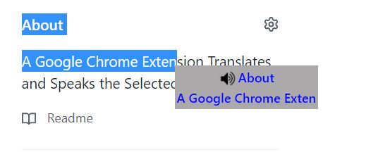

# Say IT

A google chrome extension speaks and translates the selected text.

### How To Install

- Clone Or Download the repo.
- Open chrome extensions chrome://extensions
- Enable Developer Mode.
- Click on Load unpacked and select the repo directory.
- Say It extension will apper in extension menu.

### How To Use

- Press on CTRL key.
- Select the desired word or sentense.
- A pop up menu appears with the selected text and speaker button.
- Click on the speaker button to let text to speach engine says the text.
- Click on the text to translate it with google translator.
